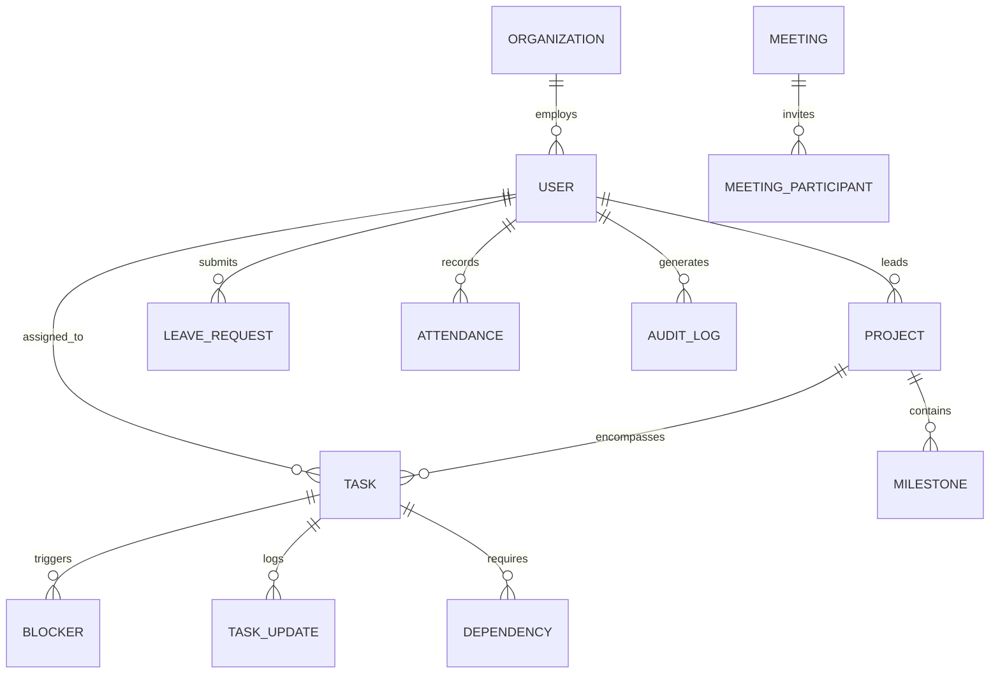

# VEIXON Command Center — Product Architecture & System Specification

**Author:** Agent A — Product Architect (CTO & Systems Strategy)  
**Organization:** VEIXON.Tech ([https://www.veixon.com/](https://www.veixon.com/))  
**Product:** VEIXON Command Center (Internal Operations & Engineering Operating System)  
**Repository:** [progress_track_and_management_website](https://github.com/siddardhvanguri-source/progress_track_and_management_website)  
**Status:** Production Grade (v1.0.0)

---

## 1. Executive Product Vision

The **VEIXON Command Center** is not a generic HR tracking portal or an administrative clone. It is the **central nervous system of VEIXON.Tech**, designed to provide high-leverage visibility and operational precision across all engineering squads, product initiatives, and cross-functional teams.

### Core Guiding Questions
Every view in the system is architected to answer four vital executive questions within seconds:
1. **WHAT IS HAPPENING?** — Instant operational pulse of ongoing deployments, active sprints, meetings, and team presence.
2. **WHY IS IT HAPPENING?** — Root-cause transparency connecting blocked tasks to upstream architectural dependencies or pending approvals.
3. **WHAT NEEDS ATTENTION?** — Critical blockers, at-risk milestones, and conflicting leaves surfaced immediately into a prioritized triage queue.
4. **WHAT SHOULD I DO NEXT?** — Deterministic, single-click actions (unblock, reassign, approve, dispatch) without navigating multi-level submenus.

---

## 2. User Personas & Target Roles

The application strictly differentiates between four core system roles, enforced at the database and API session layer:

| Role | Target Users | Core Focus | Primary JTBD |
| :--- | :--- | :--- | :--- |
| **DIRECTOR** | V S Sai Siddardh (Director & Co-Founder), Abhinav Rishi (CEO), Shlok Karn (CTO) | Macro Health & Cross-Project Velocity | Unblock mission-critical paths, reallocate resources, align roadmaps with business OKRs. |
| **MANAGER** | Engineering Leads, Product Managers (e.g. Suhas, C. Taran Teja) | Squad Execution & Capacity Balance | Triage day-to-day blockers, review sprint tasks, balance workloads, approve leaves. |
| **EMPLOYEE** | Core Engineers & Specialists (e.g. Shabnam Nisha, Sreeshith, Shivani, Arjun J, Navya) | Focus & Deep Work Execution | View assigned tasks, log rapid progress updates, raise blockers, check meeting schedule. |
| **ADMIN** | DevOps & System Operations | Security, Tenancy & Compliance | Maintain user profiles, enforce RBAC, inspect audit trails and telemetry logs. |

---

## 3. Jobs-to-be-Done (JTBD) Framework

### Director Level
- *When* I log in at the start of the week or before executive syncs,
- *I want* a synthesized, low-noise command HUD of all 5 flagship initiatives and high-severity blockers,
- *So that* I can eliminate operational gridlock before it impairs customer delivery or investor milestones.

### Engineering Lead / Manager Level
- *When* sprint dependencies fail or pull requests become stalled,
- *I want* to view affected tasks across the dependency tree with responsible owners,
- *So that* I can intervene with direct pairing or technical reassignments.

### Individual Engineer Level
- *When* I am blocked by external API credentials or infrastructure delays,
- *I want* to flag a blocker linked directly to my active task with one keystroke (`Ctrl+K` or quick-action modal),
- *So that* the issue is escalated without interrupting my flow state via manual Slack messaging.

---

## 4. Comprehensive Information Architecture (IA)

```
VEIXON Command Center
│
├── / (Public Landing Page — High-conversion VEIXON OS overview)
├── /login (Secure Single Sign-On Portal — Zero role switcher, session-driven)
│
└── /(app) [Authenticated Enterprise Shell]
    ├── /dashboard (Executive Command Center: Triage Queue, Analytical Deck, Presence, OKRs)
    ├── /work (Unified Task Board & Sprint Tracker: List, Kanban, Calendar)
    ├── /projects (Flagship Initiatives, Milestone Health, Explainable Risk Engine)
    ├── /people (Team Directory, Skills, Workloads, Active Initiatives, Direct Reach)
    ├── /calendar (Unified Operations Schedule: Sprints, Releases, Leaves, Syncs)
    ├── /meetings (Live Standup & Architecture Sync Hub, Structured Absences)
    ├── /leave (Leave Scheduling & Manager Capacity Balancing Dashboard)
    ├── /goals (Company OKRs, Key Results, Engineering Initiatives)
    ├── /blockers (Critical Architectural & Dependency Impediments Tracker)
    ├── /reports (Automated Sprint Velocity, Team Capacity & Delivery Telemetry)
    ├── /notifications (Action-Oriented Alert Dispatcher)
    ├── /settings (Enterprise System Settings, Theme & Session Management)
    ├── /profile (Personal Identity, Preferences & Audit Trail)
    └── /admin (System Configuration, Role RBAC & Security Audit Logs)
```

---

## 5. Domain Model & Module Relationships



### Module Synergy
1. **Work ↔ Projects ↔ Blockers:** Tasks inherit project context. If a task is marked `BLOCKED`, the parent Project's health algorithm automatically recalculates to `At Risk` or `Critical`.
2. **Leave ↔ Calendar ↔ Tasks:** Approved leave requests populate the unified operations calendar and warn managers if an engineer has active sprint commitments during that duration.
3. **Meetings ↔ Attendance:** Structured absence categorization (Deep Work, Client Sync, Medical) eliminates arbitrary misconduct labeling and syncs with team presence indicators.

---

## 6. Granular Permission & Authorization Matrix (RBAC)

All permission checks are executed server-side in API route handlers and server actions via `lib/auth/session.ts` and `lib/permissions.ts`. Client UI buttons merely reflect backend permissions.

| Action / Capability | DIRECTOR | MANAGER | EMPLOYEE | ADMIN |
| :--- | :---: | :---: | :---: | :---: |
| View Command Center Dashboard | ✅ Full | ✅ Full | ✅ Scoped | ✅ Full |
| Create / Edit Any Project | ✅ | ✅ | ❌ | ✅ |
| Reassign Any Task | ✅ | ✅ | ❌ (Own only) | ✅ |
| Escalate / Resolve Blockers | ✅ | ✅ | ❌ (Create only) | ✅ |
| Approve / Reject Leave Requests | ✅ | ✅ | ❌ | ✅ |
| Access Global System Audit Logs | ✅ | ❌ | ❌ | ✅ |
| Modify User Roles & Permissions | ❌ | ❌ | ❌ | ✅ |
| Trigger Export & Telemetry Reports | ✅ | ✅ | ❌ | ✅ |

---

## 7. MVP vs. Strategic Roadmap

### Phase 1 (MVP — Delivered v1.0.0)
- Complete Next.js 14 App Router architecture with zero client-side role switchers.
- Real VEIXON public team members (V S Sai Siddardh, Abhinav Rishi, Shlok Karn, etc.) pre-seeded with genuine roles.
- Reactive Dashboard with 3 Horizon Views (`OPERATIONAL`, `ANALYTICAL`, `STRATEGIC`).
- Recharts data visualization deck (Sprint Velocity, Squad Presence, Project Bar Chart).
- Complete Work Board (Kanban & List), Projects Health, Calendar, Meetings, Leave, Blockers, Goals, Reports, Settings.
- SQLite + Prisma ORM database with full foreign key constraints and automated seeding.
- Full Vercel deployment readiness (`prisma generate` on postinstall, image whitelisting).
- 100% automated test coverage across business logic, RBAC, and end-to-end user flows.

### Phase 2 (Strategic Enhancements)
- Webhook integrations with GitHub Pull Requests and Linear issues.
- Real-time WebSocket pub/sub for instant collaborative Kanban updates.
- Export to encrypted compliance reports (SOC2 / ISO 27001 audit packs).
- Multi-tenancy isolation for subsidiary ventures and spin-offs.

---

## 8. Technical Architecture Recommendations

1. **Database Strategy:** SQLite locally for development and fast automated tests; seamless migration to PostgreSQL / Supabase for clustered cloud deployments by changing `DATABASE_URL`.
2. **State Management:** URL search params for bookmarkable filter state (e.g. `?horizon=OPERATIONAL&status=IN_PROGRESS`); React Server Components for ultra-fast SSR initial page loads.
3. **Security Standards:** HttpOnly, SameSite=Lax session cookies with SHA-256 password hashing. Zero secrets exposed to client-side bundles.
